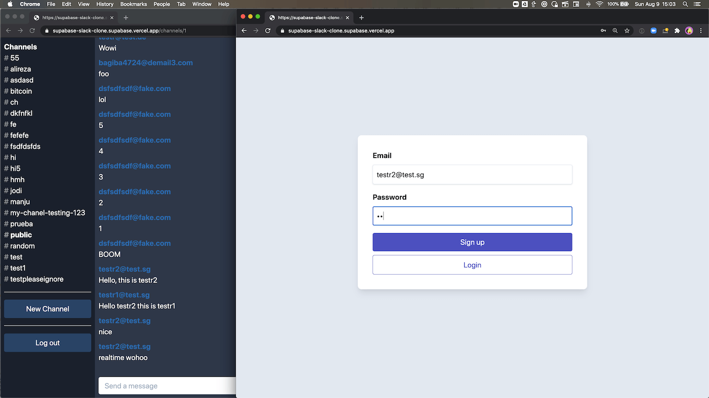

# 使用 Supabase 的实时聊天示例

这是一个全栈 Slack 克隆示例，使用：

- 前端：
  - [Next.js](https://github.com/vercel/next.js) - 生产级 React 框架。
  - [Supabase.js](https://supabase.com/docs/library/getting-started) - 用于用户管理和实时数据同步。
- 后端：
  - [supabase.com/dashboard](https://supabase.com/dashboard/)：托管的 Postgres 数据库，提供 RESTful API 供 Supabase.js 使用。

## 演示

- CodeSandbox: https://codesandbox.io/s/github/supabase/supabase/tree/master/examples/nextjs-slack-clone



## 使用 Vercel 部署

Vercel 部署将引导您创建 Supabase 账户和项目。安装 Supabase 集成后，所有相关环境变量将自动设置，项目部署后即可立即使用 🚀

[](https://vercel.com/new/clone?repository-url=https%3A%2F%2Fgithub.com%2Fsupabase%2Fsupabase%2Ftree%2Fmaster%2Fexamples%2Fslack-clone%2Fnextjs-slack-clone&project-name=supabase-nextjs-slack-clone&repository-name=supabase-nextjs-slack-clone&integration-ids=oac_VqOgBHqhEoFTPzGkPd7L0iH6&external-id=https%3A%2F%2Fgithub.com%2Fsupabase%2Fsupabase%2Ftree%2Fmaster%2Fexamples%2Fslack-clone%2Fnextjs-slack-clone)

## 从零开始构建

### 1. 创建新项目

注册 Supabase - [https://supabase.com/dashboard](https://supabase.com/dashboard) 并创建一个新项目。等待数据库启动。

### 2. 运行"Slack 克隆"快速入门

数据库启动后，运行"Slack Clone"快速入门。


### 3. 获取 URL 和 Key

进入项目设置（齿轮图标），打开 API 标签页，找到您的 API URL 和 `anon` key。下一步会用到这些。

`anon` key 是您的客户端 API key。它允许"匿名访问"您的数据库，直到用户登录。登录后，key 将切换为用户自己的登录令牌。这为您的数据启用了行级安全。在[下方](#postgres-行级安全)了解更多。


**_注意_**：`service_role` key 拥有对数据的完全访问权限，可绕过任何安全策略。这些 key 必须保密，仅用于服务器环境，绝不能在客户端或浏览器中使用。

## Supabase 详细信息

### 使用远程 Supabase 项目

1. 在 [Supabase 控制台](https://supabase.com/dashboard)创建或选择一个项目。
2. 复制并填写 dotenv 模板 `cp .env.production.example .env.production`
3. 链接本地项目并将本地配置与远程配置合并：

```bash
SUPABASE_ENV=production npx supabase@latest link --project-ref <your-project-ref>
```

3. 同步配置：

```bash
SUPABASE_ENV=production npx supabase@latest config push
```

4. 同步数据库架构：

```bash
SUPABASE_ENV=production npx supabase@latest db push
```

## Vercel 预览分支

Supabase 与 Vercel 的预览分支无缝集成，为每个分支提供独立的 Supabase 项目。此设置允许在应用到生产环境之前安全地测试数据库迁移或服务配置。

### 步骤

1. 确保 Vercel 项目已链接到 Git 仓库。
2. 在 Vercel 中配置"Preview"环境变量：

   - `NEXT_PUBLIC_SUPABASE_URL`
   - `NEXT_PUBLIC_SUPABASE_PUBLISHABLE_KEY`

3. 创建新分支，进行更改（例如更新 `max_frequency`），并将分支推送到 Git。
   - 打开 Pull Request 以触发 Vercel + Supabase 集成。
   - 部署成功后，预览环境将反映更改。


---

### 基于角色的访问控制 (RBAC)

使用[加号寻址](https://en.wikipedia.org/wiki/Email_address#Subaddressing)注册具有 `admin` 和 `moderator` 角色的用户。包含 `+supaadmin@` 的邮箱地址将被分配 `admin` 角色，包含 `+supamod@` 的邮箱地址将被分配 `moderator` 角色。例如：

```
// 管理员用户
email+supaadmin@example.com

// 版主用户
email+supamod@example.com
```

具有 `moderator` 角色的用户可以删除所有消息。具有 `admin` 角色的用户可以删除所有消息和频道（注意：不建议删除 `public` 频道）。

### Postgres 行级安全

此项目使用 Postgres 的行级安全实现非常高级的授权控制。
当您在 Supabase 上启动 Postgres 数据库时，我们会为其填充一个 `auth` 架构和一些辅助函数。
当用户登录时，他们会获得一个包含 `authenticated` 角色和其 UUID 的 JWT。
我们可以使用这些详细信息对每个用户可以做什么和不可以做什么进行精细控制。

- 完整架构请参考 [full-schema.sql](./full-schema.sql)。
- 有关基于角色的访问控制文档，请参考 [文档](https://supabase.com/docs/guides/auth/custom-claims-and-role-based-access-control-rbac)。

## 作者

- [Supabase](https://supabase.com)

Supabase 是开源项目，欢迎您关注并参与：https://github.com/supabase/supabase